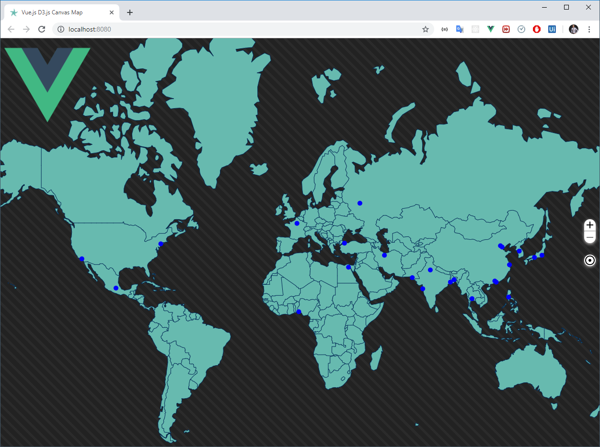

# Vue.js D3.js Canvas Map Example


Example of a canvas map dashboard using Vue.js and D3.js.

## Project setup
```
npm install
```

### Compiles and hot-reloads for development
```
npm run serve
```

### Compiles and minifies for production
```
npm run build
```

### Run your tests
```
npm run test
```

### Lints and fixes files
```
npm run lint
```